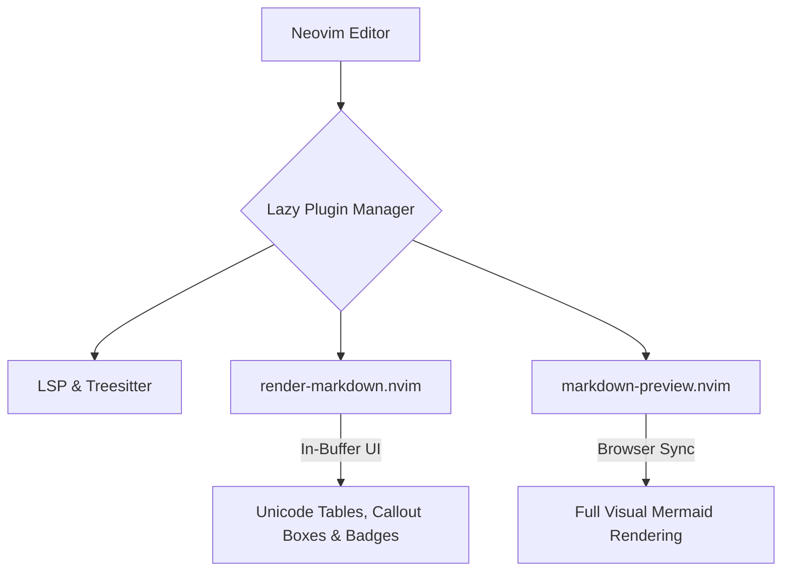

# 🎨 Render Markdown Showcase

This file demonstrates the visual rendering capabilities of **`render-markdown.nvim`** in Neovim.

---

## 📊 1. Styled Tables

### Plugin & Feature Matrix
| Plugin Name | Category | Primary Function | VS Code Equivalent | Status |
| :--- | :--- | :--- | :--- | :---: |
| `render-markdown.nvim` | Documentation | In-buffer rich Markdown rendering | Markdown Preview Enhanced | ✅ Active |
| `snacks.nvim` | UI / Workflow | Project picker & floating terminals | VS Code Workspaces / Terminal | ✅ Active |
| `persistence.nvim` | Session | Session & layout restoration | Workspace restore | ✅ Active |
| `themery.nvim` | Theme | Interactive live theme switcher | Theme picker (`Ctrl+K Ctrl+T`) | ✅ Active |
| `trouble.nvim` | Diagnostics | Workspace diagnostics drawer | Problems panel | ✅ Active |
| `sidekick.nvim` | AI Assistant | Antigravity AI pair programming | Copilot / Claude sidebar | ✅ Active |

### IDE Performance & Benchmark Comparison
| Metric / Feature | Neovim + LazyVim | VS Code | Sublime Text |
| :--- | :---: | :---: | :---: |
| **Startup Time** | `< 45ms` | `~1200ms` | `~150ms` |
| **Memory Footprint** | `~65 MB` | `~850 MB` | `~95 MB` |
| **LSP Intelligence** | Native (Blink + Treesitter) | Built-in | LSP Plugin |
| **Modal Editing** | Native Vim keymaps | Extension (`Vim`/`VSCodeVim`) | Vintage Mode |
| **AI Integration** | `sidekick.nvim` + `agy` | GitHub Copilot / Cursor | External Plugins |

---

## 📌 2. GitHub-Style Callout Boxes (Admonitions)

> [!NOTE]
> This is a **Note** callout. Used to provide helpful background context, setup tips, or non-critical details.

> [!TIP]
> **Performance Tip:** You can quickly toggle in-buffer markdown rendering on and off using the command `:RenderMarkdown toggle`.

> [!IMPORTANT]
> The `render-markdown.nvim` plugin only decorates buffers in Normal and Visual modes. When you enter Insert mode (`i`), the raw markdown text temporarily reveals itself for seamless editing!

> [!WARNING]
> Ensure your terminal font has **Nerd Font** glyphs enabled (e.g. JetBrains Mono Nerd Font) to display the table corner glyphs and icons properly.

> [!CAUTION]
> Avoid manually modifying `lazy-lock.json` directly—always allow Lazy to manage lockfile revisions via `:Lazy sync` or `:Lazy update`.

---

## 📋 3. Interactive Task & Feature Checklist

- [x] Configure base LazyVim foundation
- [x] Install project workspace picker (`snacks.nvim`)
- [x] Add multi-theme switcher (`themery.nvim`)
- [x] Integrate Antigravity AI assistant (`sidekick.nvim`)
- [x] Enable rich markdown table and callout renderer (`render-markdown.nvim`)
- [ ] Add interactive debugger (`lazyvim.plugins.extras.dap.core`)
- [ ] Add test explorer (`lazyvim.plugins.extras.test.core`)
- [ ] Add 3-way Git merge tool (`diffview.nvim`)

---

## 💻 4. Code Block with Language Badges

```lua
-- Lua snippet to inspect active markdown highlights
local render_markdown = require("render-markdown")

render_markdown.setup({
  heading = {
    enabled = true,
    sign = true,
    icons = { "󰉫 ", "󰉬 ", "󰉭 ", "󰉮 ", "󰉯 ", "󰉰 " },
  },
  bullet = {
    icons = { "●", "○", "◆", "◇" },
  },
  checkbox = {
    enabled = true,
  },
})
```

```python
# Python snippet
def calculate_efficiency(startup_ms: float, memory_mb: float) -> str:
    score = (1000 / startup_ms) * (500 / memory_mb)
    return f"Efficiency Index: {score:.2f} pts"

print(calculate_efficiency(42.5, 64.0))
```

---

## 📈 5. Mermaid Architecture Diagram



