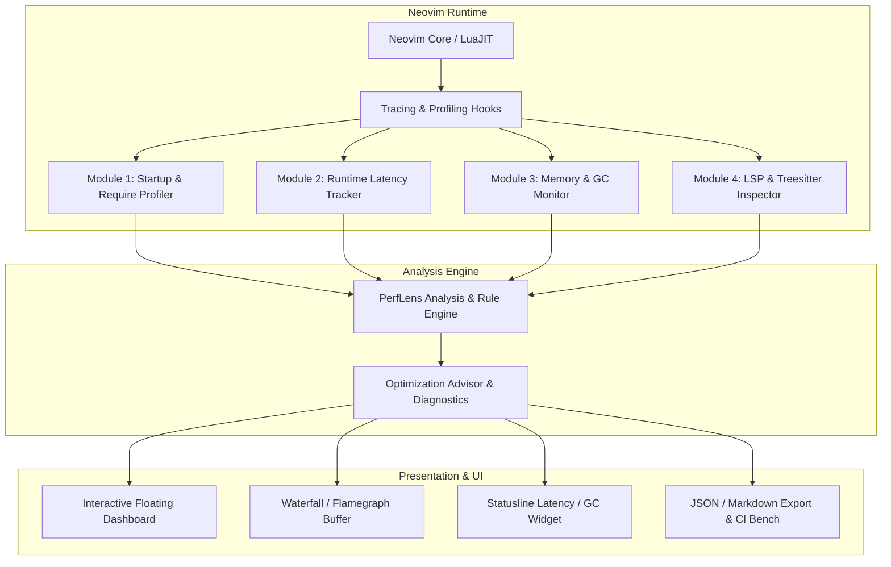
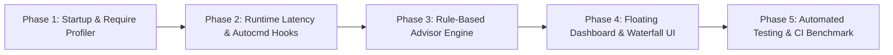

# Neovim Performance Analyzer & Optimizer Specification (`nvim-perf-lens.nvim`)

> **Document Type:** Plugin Design & Implementation Specification  
> **Target Environment:** Neovim `>= 0.10.0` (LuaJIT)  
> **Plugin Name:** `nvim-perf-lens.nvim` (or `perf-lens.nvim`)  
> **Status:** Draft / Specification Ready for Implementation  

---

## 1. Executive Summary & Vision

Modern Neovim distributions often suffer from performance degradation, micro-stutters, and bloated startup times caused by:
- Eager plugin loading and unnecessary top-level `require()` calls.
- Expensive autocommands firing synchronously on high-frequency events (`CursorMoved`, `TextChanged`, `BufEnter`).
- LSP semantic token compute overhead and blocking I/O calls.
- Lua memory leaks and unbounded table accumulation triggering aggressive Garbage Collection (GC) pauses.
- Complex Treesitter query parsing on large files.

`nvim-perf-lens.nvim` is a lightweight, zero-overhead-when-idle performance analyzer and optimization advisor for Neovim. It profiles startup, monitors runtime latency, visualizes bottleneck timelines (waterfall & flame graphs), and provides actionable optimization recommendations to achieve sub-20ms startup and 60+ FPS buttery-smooth editing.

---

## 2. Core Architecture & Modules



### Module Breakdown

| Module | Purpose | Mechanism |
| :--- | :--- | :--- |
| **`perf_lens.startup`** | Startup timeline & plugin loading breakdown | Hooks into `package.loaders`, `require`, and `lazy.nvim` event hooks using `vim.uv.hrtime()`. |
| **`perf_lens.runtime`** | Latency & jitter detection during normal editing | Measures execution duration of autocommands, user keymaps, and buffer render cycles. |
| **`perf_lens.require_graph`** | Require hierarchy & circular dependency analyzer | Builds a directed dependency graph of all loaded Lua modules with per-module cost. |
| **`perf_lens.memory`** | LuaJIT heap & memory leak detection | Tracks `collectgarbage("count")` deltas per operation, identifying runaway allocations. |
| **`perf_lens.lsp_ts`** | LSP client latency & Treesitter parsing inspector | Intercepts `vim.lsp.client.request` / notification handlers and measures TS parse time per buffer. |
| **`perf_lens.advisor`** | Rule-based optimization diagnostics engine | Evaluates metrics against optimization rules and generates concrete code suggestions. |
| **`perf_lens.ui`** | Native terminal UI & visualizers | Interactive floating modal, bar graphs, waterfall chart, and Snacks/Telescope picker integration. |

---

## 3. Detailed Functional Specifications

### 3.1 Startup & Require Profiler (`perf_lens.startup`)

* **Microsecond-Precision Startup Phases**:
  * Phase 1: `init.lua` initial parsing & core options set.
  * Phase 2: Package manager (`lazy.nvim`) bootstrap & spec registration.
  * Phase 3: Eager plugin loading (`lazy = false`).
  * Phase 4: `UIEnter` / `VimEnter` events.
  * Phase 5: First buffer read (`BufReadPost`) & initial filetype detection.
* **Top-Level `require()` Audit**:
  * Wraps `require` in a minimal tracing layer to record caller location, module name, and execution duration in microseconds.
  * Highlights modules taking $> 3\text{ms}$ to load.
* **Lazy Loading Verification**:
  * Flags plugins configured as `lazy = false` that do not touch core startup hooks.
  * Identifies plugins that loaded prematurely during `init.lua` evaluation.

### 3.2 Runtime & Event Latency Tracker (`perf_lens.runtime`)

* **Autocommand Latency Profiler**:
  * Hooks into `nvim_create_autocmd` / `nvim_exec_autocmds` to measure runtime cost.
  * Automatically flags slow handlers attached to `CursorMoved`, `CursorHold`, `TextChangedI`, `BufWinEnter`, and `LspAttach`.
* **Micro-Stutter / Frame Drop Detection**:
  * Monitors the Neovim event loop using `vim.uv.new_check()` / `new_idle()`.
  * Logs when the main thread is blocked for $> 16.6\text{ms}$ (1 dropped frame at 60Hz) or $> 33.3\text{ms}$ (30Hz).
* **Buffer Processing Latency**:
  * Measures time spent in fold calculation, diagnostics publishing, and sign column updates.

### 3.3 LuaJIT Memory & GC Pressure Monitor (`perf_lens.memory`)

* **Memory Delta Tracking**:
  * Tracks memory before and after large operations (e.g. Telescope search, Treesitter highlight refresh, LSP workspace symbol query).
* **GC Stress Profiling**:
  * Analyzes how frequently LuaJIT full GC cycles occur and whether manual GC threshold tuning (`collectgarbage("setpause", ...)` / `setstepmul`) improves latency.

### 3.4 Automated Performance Advisor & Optimizer Rules (`perf_lens.advisor`)

The plugin includes a heuristic rule engine that inspects your running Neovim state and produces warnings and fixes:

1. **Rule: `EAGER_HEAVY_PLUGIN`**
   * *Trigger:* Plugin taking $> 15\text{ms}$ during startup without defining `event`, `cmd`, `ft`, or `keys`.
   * *Recommendation:* Suggests optimal `event` (e.g., `VeryLazy`, `BufReadPre`, `CmdlineEnter`).
2. **Rule: `EXPENSIVE_CURSOR_AUTOCMD`**
   * *Trigger:* Autocommand on `CursorMoved` taking $> 2\text{ms}` on average.
   * *Recommendation:* Suggests debouncing or switching to `CursorHold` with an adjusted `updatetime`.
3. **Rule: `BLOCKING_IO_IN_MAIN_THREAD`**
   * *Trigger:* Synchronous `io.popen`, `vim.fn.system`, or `vim.fs` scans in active buffer thread.
   * *Recommendation:* Suggests replacing with `vim.uv.spawn` or `vim.system({ ... }, { text = true })`.
4. **Rule: `DUPLICATE_TREESITTER_PARSERS`**
   * *Trigger:* Multiple parser queries running against overlapping injection ranges.
   * *Recommendation:* Adjust `ensure_installed` or disable unused highlight injections.
5. **Rule: `LSP_PAYLOAD_BLOAT`**
   * *Trigger:* LSP client returning $> 500\text{KB}$ diagnostics payloads causing UI lag.
   * *Recommendation:* Enable debounce for diagnostics (`vim.diagnostic.config({ update_in_insert = false })`).

---

## 4. UI & Interactive Visualizer Specification

### 4.1 Dashboard View (`:PerfLens` / `:PerfLens dashboard`)

```text
╭────────────────────────────── Neovim Performance Lens ──────────────────────────────╮
│ Startup Time: 18.4ms (⚡ Excellent)   Lua Memory: 14.2 MB   Active Buffers: 6       │
├──────────────────────────────────────────────────────────────────────────────────────┤
│ ⏱️ Top Startup Bottlenecks:                                                         │
│   1. telescope.nvim           6.2ms   [Eager] ⚠️ Suggestion: event = 'VeryLazy'      │
│   2. nvim-treesitter          4.1ms   [BufRead]                                      │
│   3. nvim-lspconfig           3.8ms   [BufReadPre]                                   │
│   4. catppuccin               2.1ms   [Colorscheme]                                  │
│                                                                                      │
│ 🔄 Slow Autocommands (Past 60s):                                                     │
│   • CursorMoved -> gitsigns.nvim (refresh)      avg 3.4ms (max 8.1ms) ⚠️ Slow        │
│   • TextChanged -> indent-blankline             avg 1.2ms (max 2.4ms)                │
│                                                                                      │
│ 💡 Optimization Advisor (3 Recommendations):                                        │
│   [FIX 1] Convert `telescope.nvim` to load on `<leader>ff` / `CmdlineEnter`         │
│   [FIX 2] Set `vim.opt.updatetime = 200` to optimize `CursorHold` debouncing         │
│   [FIX 3] Enable `vim.loader.enable()` (Bytecode caching is currently DISABLED!)    │
├──────────────────────────────────────────────────────────────────────────────────────┤
│ [a] Apply Fix   [w] Waterfall View   [r] Refresh   [e] Export Report   [q] Close     │
╰──────────────────────────────────────────────────────────────────────────────────────╯
```

### 4.2 Waterfall Timeline (`:PerfLens timeline` / `:PerfLens waterfall`)

ASCII / Unicode graphical timeline highlighting concurrency and sequential blockers:

```text
0.0ms ───────────────────────────────────────────────────────────── 25.0ms
init.lua           [====] (1.2ms)
vim.loader         [=] (0.4ms)
lazy.nvim setup          [==========] (3.8ms)
  load: tokyonight                   [====] (1.8ms)
  load: snacks.nvim                        [======] (2.4ms)
  load: treesitter                                [===========] (4.5ms)
UIEnter / Ready                                               [VIM READY: 14.1ms]
```

---

## 5. Lua Directory Layout & File Architecture

```text
lua/perf_lens/
├── init.lua                 -- Main setup, entry points, configuration merges
├── config.lua               -- Default settings, thresholds, and user options
├── core/
│   ├── profiler.lua         -- hrtime wrapper and profiling state tracker
│   ├── require_hook.lua     -- require() and package.loaders interception layer
│   ├── autocmd_hook.lua     -- nvim_create_autocmd & dispatch instrumentation
│   ├── memory.lua           -- LuaJIT memory allocation & GC snapshot tracker
│   └── event_loop.lua       -- UV check/idle jitter & dropped frame detector
├── analyzers/
│   ├── startup.lua          -- Analyzes startup metrics & phases
│   ├── runtime.lua          -- Analyzes live runtime latency and jitter
│   ├── lsp.lua              -- LSP handler response times & diagnostic payload size
│   └── treesitter.lua       -- Treesitter query and parse benchmark
├── advisor/
│   ├── engine.lua           -- Rule evaluator
│   └── rules/               -- Modular optimization rules
│       ├── eager_plugins.lua
│       ├── autocmd_lag.lua
│       ├── byte_loader.lua
│       └── memory_leak.lua
├── ui/
│   ├── dashboard.lua        -- Interactive floating window dashboard
│   ├── waterfall.lua        -- Waterfall chart generator
│   ├── flamegraph.lua       -- Flame graph text/SVG generator
│   └── highlights.lua       -- Catppuccin / Tokyonight / Modern highlight links
└── health.lua               -- checkhealth perf_lens integration
```

---

## 6. User Commands & Keybindings

| Command | Action | Description |
| :--- | :--- | :--- |
| `:PerfLens` | Toggle Dashboard | Opens the main interactive performance dashboard. |
| `:PerfLens startup` | Startup Profile | Displays detailed millisecond breakdown of plugin loading. |
| `:PerfLens live` | Toggle Live Monitor | Toggles a floating / winbar live FPS and autocommand latency tracker. |
| `:PerfLens advisor` | View Suggestions | Lists actionable optimization advice with one-key auto-fix hints. |
| `:PerfLens waterfall` | Waterfall Chart | Renders ASCII timeline of Neovim startup sequence. |
| `:PerfLens memory` | Memory & GC Audit | Inspects Lua heap, table memory footprint, and garbage collection. |
| `:PerfLens export [file]`| Export Report | Generates markdown / JSON benchmark report (ideal for CI/CD). |

---

## 7. LazyVim Integration Spec (`lua/plugins/perf_lens.lua`)

```lua
return {
  {
    "pkshrestha/nvim-perf-lens.nvim",
    cmd = { "PerfLens" },
    keys = {
      { "<leader>up", "<cmd>PerfLens<cr>", desc = "Performance Dashboard" },
      { "<leader>uP", "<cmd>PerfLens startup<cr>", desc = "Startup Profile Breakdown" },
      { "<leader>ua", "<cmd>PerfLens advisor<cr>", desc = "Optimization Advisor" },
      { "<leader>uw", "<cmd>PerfLens waterfall<cr>", desc = "Startup Waterfall View" },
    },
    opts = {
      enable_on_startup = true, -- Zero-overhead hooks during startup
      thresholds = {
        slow_plugin_ms = 5.0,    -- Flag plugins taking > 5ms during startup
        slow_autocmd_ms = 2.0,   -- Flag autocommands taking > 2ms
        frame_drop_ms = 16.6,    -- Detect main thread blocks > 16.6ms
      },
      track_lsp = true,
      track_treesitter = true,
      track_memory = true,
      auto_loader_check = true, -- Verifies vim.loader.enable() is active
    },
  },
}
```

---

## 8. Implementation Milestones



1. **Phase 1 (Core Profiler):** High-precision `hrtime` tracing for `require`, `vim.loader`, and startup events.
2. **Phase 2 (Runtime Tracing):** UV idle/check timer loop for stutter detection and autocommand execution timers.
3. **Phase 3 (Optimization Advisor):** Built-in heuristics for lazy-loading recommendations, byte-loader checks, and blocking calls.
4. **Phase 4 (UI & Visualizations):** Floating dashboard with syntax-highlighted bar charts, waterfall timeline, and keymap navigation.
5. **Phase 5 (Diagnostics & Export):** `:checkhealth perf_lens` integration and headless benchmarking runner (`nvim --headless "+PerfLens export report.json" +qa`).
